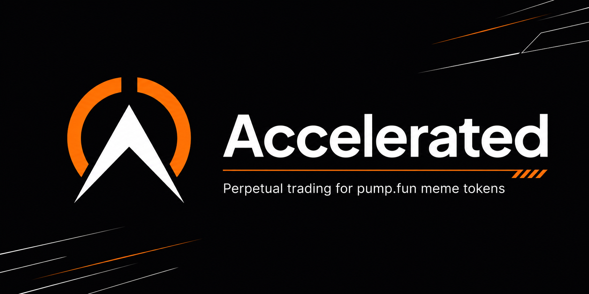
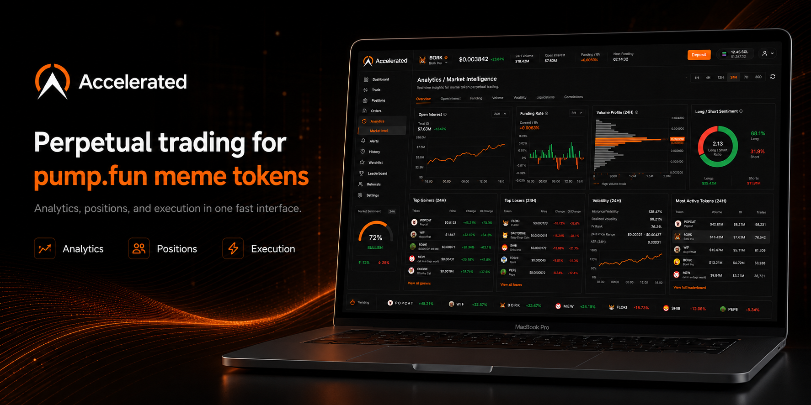
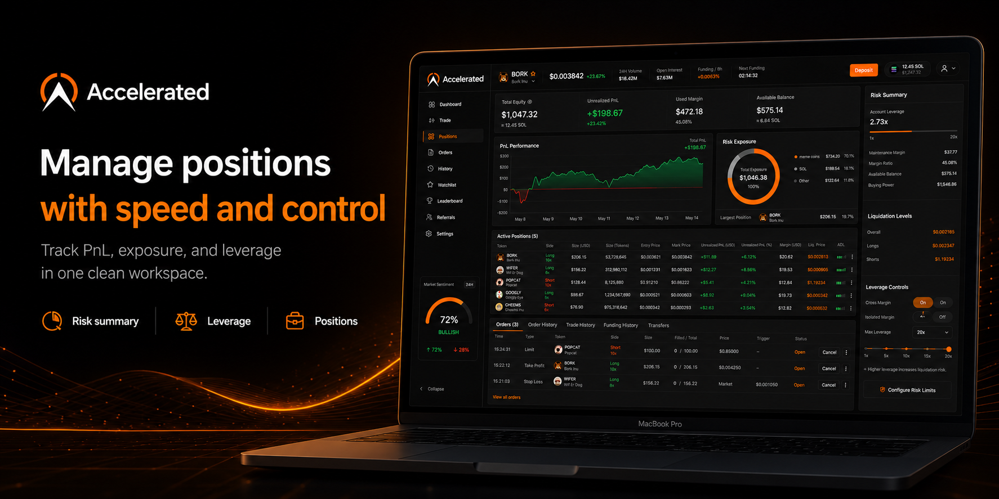

<div align="center">



### Leverage the trenches. Every coin. Up to 5×.

**Accelerated** is a permissionless perpetual-futures layer for the long tail of Solana memecoins.
It lets *any* token that has graduated on Pump.fun be leverage-traded up to **5×** — regardless of
market cap, liquidity, or how degenerate the chart looks — by routing risk through a unified,
oracle-priced margin engine instead of fragmented AMM pools.

[](#)
[](#)
[](#)
[](LICENSE)
[](#)

[**Website**](#) · [**Docs**](docs/) · [**App**](apps/web) · [**Whitepaper**](docs/whitepaper.md) · [**Risk Engine**](docs/risk-engine.md)

</div>

---

> [!WARNING]
> **Accelerated is experimental, unaudited software and a research prototype.** Nothing here is
> financial advice. Leverage trading of low-liquidity memecoins is extraordinarily risky and you
> can lose 100% of your collateral in a single block. This repository is published for engineering
> and research transparency. Do not deploy to mainnet with real funds.

## Preview

<div align="center">






</div>

<sub>Product preview. The trading terminal lives in [`apps/web`](apps/web); these renders show the intended UI.</sub>

## Why Accelerated

The "trenches" — the firehose of freshly-graduated Pump.fun coins — generate enormous spot volume
but have **no derivatives layer**. You can't short the obvious rug. You can't lever a conviction
play. Liquidity is too thin and too short-lived for a traditional order book or a Drift-style vAMM
to bootstrap a market per token.

Accelerated solves this with a single **shared liquidity vault** and a **synthetic, oracle-settled
margin model**. Traders never touch the underlying AMM; they post USDC collateral and take a
directional position that settles against a manipulation-resistant TWAP. One vault backs thousands
of markets, so a coin needs *zero* dedicated liquidity to become leverage-tradable the moment it
graduates.

```
   Pump.fun graduation  ──▶  Oracle adapter (TWAP + confidence)  ──▶  Accelerated market (live in 1 slot)
                                                                              │
   Trader posts USDC  ──────────────────────────────────────────────────────┤
                                                                              ▼
                                                          Shared ALP vault absorbs PnL & funding
```

## Features

| | |
|---|---|
| ⚡ **Instant markets** | Any graduated Pump.fun mint becomes tradable in a single transaction — no per-market liquidity bootstrap. |
| 🎯 **Up to 5× leverage** | Isolated or cross margin, long or short, on coins from $30K to $300M FDV. |
| 🛡️ **Shared ALP vault** | One delta-neutral-ish liquidity pool underwrites every market and earns funding + liquidation fees. |
| 📈 **Manipulation-resistant pricing** | Confidence-weighted TWAP oracle with circuit breakers; thin coins get tighter caps automatically. |
| 🧮 **Dynamic risk engine** | Per-market leverage caps, position limits, and maintenance margin scale with on-chain liquidity depth. |
| 💸 **Funding rate** | Continuous funding keeps perp price anchored to spot and pays the vault. |
| 🤖 **Keeper network** | Permissionless liquidators and funding crankers earn protocol-paid bounties. |
| 🪙 **No new token required** | Collateral and settlement in USDC. Markets reference existing SPL mints. |

## Architecture

Accelerated is a Solana-native monorepo. The on-chain program is written in **Anchor**, the trading
terminal in **Next.js**, and everything is wired together by a typed **TypeScript SDK**.

```
accelerated/
├── programs/accelerated/      # Anchor program — markets, vault, margin, liquidation
│   └── src/
│       ├── instructions/     # initialize_market, open_position, close_position, liquidate …
│       ├── state/            # Market, Position, Vault, OracleConfig
│       └── utils/            # fixed-point math, funding, margin checks
├── packages/
│   ├── sdk/                  # Typed client — build & send instructions, decode accounts
│   └── risk-engine/          # Off-chain risk simulator & leverage-cap calculator
├── apps/web/                 # Next.js 14 trading terminal (App Router + Tailwind)
└── docs/                     # Whitepaper, risk model, oracle design, threat model
```

### How a trade flows

1. **Quote** — the SDK pulls the market's oracle price + funding and computes entry, fees, and the
   liquidation price for the requested size and leverage.
2. **Open** — `open_position` transfers USDC collateral into the vault, mints a `Position` PDA, and
   records entry price/size against the market's open-interest caps.
3. **Mark** — keepers crank funding each hour; unrealized PnL is marked against the latest TWAP.
4. **Close / Liquidate** — `close_position` settles PnL from the vault; if margin ratio falls below
   maintenance, any keeper can call `liquidate` and collect a bounty.

See [`docs/architecture.md`](docs/architecture.md) for the full sequence diagrams.

## Quickstart

> Requires Rust 1.79+, Solana CLI 1.18+, Anchor 0.30.1, Node 20+, and pnpm 9+.

```bash
# 1. Install deps
pnpm install

# 2. Build & test the on-chain program
anchor build
anchor test

# 3. Run the trading terminal against devnet
pnpm --filter @accelerated/web dev
# ▸ http://localhost:3000
```

Spin up a local validator with seeded markets:

```bash
pnpm localnet           # solana-test-validator + program deploy
pnpm seed:markets       # creates a handful of mock graduated coins
```

## Leverage & risk parameters

Leverage is **not** a flat 5× everywhere — the risk engine scales the cap to each coin's on-chain
depth so the vault is never on the wrong side of an un-hedgeable position.

| Tier | Liquidity (graduated AMM) | Max leverage | Maint. margin | Max position |
|------|---------------------------|--------------|---------------|--------------|
| **Blue**  | > $2M    | 5.0× | 8%  | $50,000 |
| **Green** | $500K–$2M | 4.0× | 12% | $20,000 |
| **Amber** | $100K–$500K | 3.0× | 18% | $7,500 |
| **Red**   | $30K–$100K | 2.0× | 25% | $2,000 |

Tiers are recomputed every funding interval. See [`docs/risk-engine.md`](docs/risk-engine.md) and
[`packages/risk-engine`](packages/risk-engine) for the model.

## Roadmap

- [x] Core margin & vault program (devnet)
- [x] Oracle adapter with confidence-weighted TWAP
- [x] Trading terminal MVP
- [ ] Permissionless keeper SDK & bounty market
- [ ] Cross-margin accounts
- [ ] On-chain insurance fund auctions
- [ ] Mainnet beta (post-audit, gated)

## Contributing

PRs welcome. Read [`CONTRIBUTING.md`](CONTRIBUTING.md) and the [`SECURITY.md`](SECURITY.md) policy
first. All on-chain changes need passing `anchor test` and a risk-engine sim.

## Team

Building Accelerated.

<table>
  <tr>
    <td align="center">
      <a href="https://github.com/devharrisonlynch">
        <br />
        <sub><b>Harrison Lynch</b></sub><br />
        <sub>Co-founder · Protocol</sub>
      </a>
    </td>
    <td align="center">
      <a href="https://x.com/0xsrmessi">
        <br />
        <sub><b>@0xsrmessi</b></sub><br />
        <sub>Co-founder · Growth</sub>
      </a>
    </td>
  </tr>
</table>

## Supporters

Backing Accelerated.

<table>
  <tr>
    <td align="center">
      <a href="https://x.com/toly">
        <br />
        <sub><b>@toly</b></sub><br />
        <sub>Supporter</sub>
      </a>
    </td>
  </tr>
</table>

## License

[AGPL-3.0](LICENSE) © Accelerated contributors. This is research software — see the warning above.
